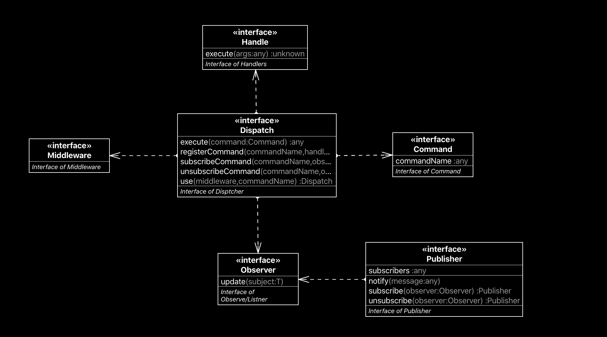

[](https://www.npmjs.com/package/command-bus-ts)
[](https://travis-ci.org/gustavobeavis/command-bus-ts)
[](https://snyk.io/test/github/gustavobeavis/command-bus-ts?targetFile=package.json)
[](https://codeclimate.com/github/gustavobeavis/command-bus-ts/maintainability)
[](https://codeclimate.com/github/gustavobeavis/command-bus-ts/test_coverage)

# Command-Buss

This project provide a simple and decoupled solution from a command handle structure with supports of publish subscribe.



## Usage


### Install
```shell
npm i command-bus-ts
```

### Basic Usage
```js
var CommandBus = require('command-bus-ts').CommandBus
var test = new CommandBus();

test
    .registerCommand('ok', {
      execute: (...req) => {
          return 'done'
      }
    })
    .use((req, next) => {
      req.x = 'xxx';
      console.log('global Middleware', req);
      next();
    })
    .use((req, next) => {
      req.y = 'yyy';
      console.log('local Middleware', req);
      next();
    }, 'ok')
    .use((req, next) => {
      req.handle.execute(req);
      req.handle.execute = function(test){
        console.log('changed')
        return 'done changed';
      }
      console.log('local Middleware change handle', req);
      next();
    }, 'ok')
    .subscribeCommand('ok', {
      update: (subject) => {
        console.log('alert', subject);
      }
    });
    const res = test.execute(
    {
      commandName: 'ok',
      aaa: 1
    });
/**
  global Middleware {
  command: { commandName: 'ok', aaa: 1 },
  commandName: 'ok',
  handle: { execute: [Function: execute] },
  middlewares: [ [Function], [Function] ],
  listners: DefaultPublisher { subscribers: Set { [Object] } },
  x: 'xxx'
}
local Middleware {
  command: { commandName: 'ok', aaa: 1 },
  commandName: 'ok',
  handle: { execute: [Function: execute] },
  middlewares: [ [Function], [Function] ],
  listners: DefaultPublisher { subscribers: Set { [Object] } },
  x: 'xxx',
  y: 'yyy'
}
local Middleware change handle {
  command: { commandName: 'ok', aaa: 1 },
  commandName: 'ok',
  handle: { execute: [Function] },
  middlewares: [ [Function], [Function] ],
  listners: DefaultPublisher { subscribers: Set { [Object] } },
  x: 'xxx',
  y: 'yyy'
}
changed
alert {
  req: { commandName: 'ok', aaa: 1 },
  res: 'done changed',
  error: undefined
}
response of done changed
**/
```
see more in [docs](https://gustavobeavis.github.io/command-bus-ts/classes/commandbus.html)
